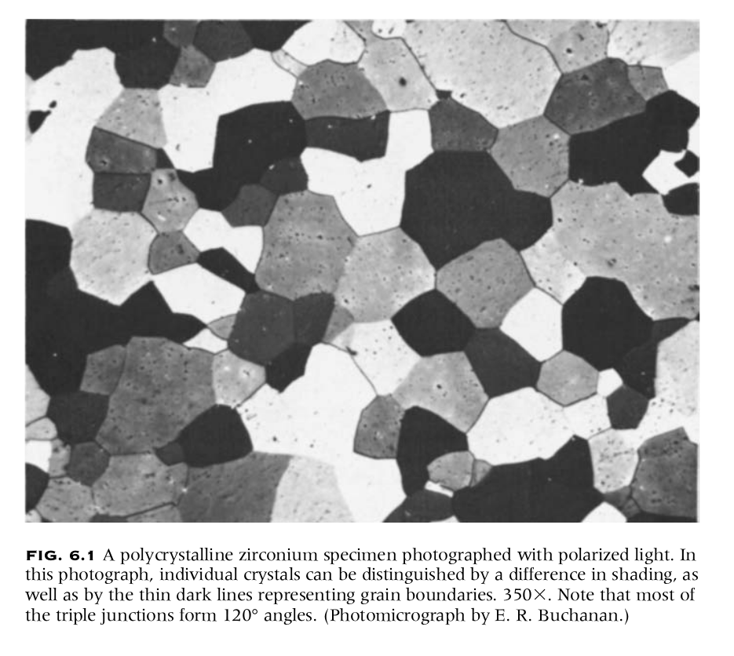
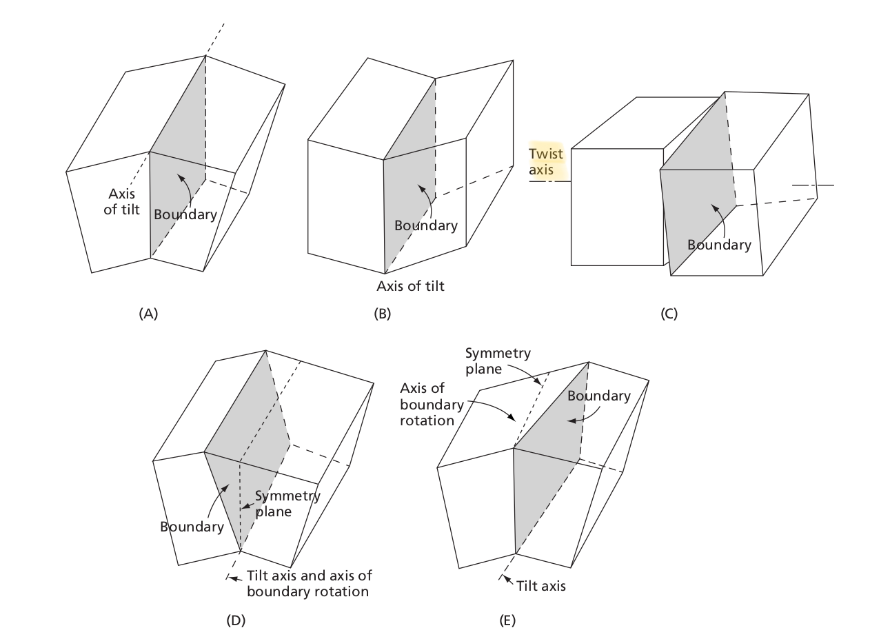
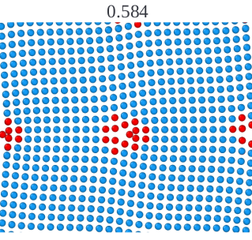
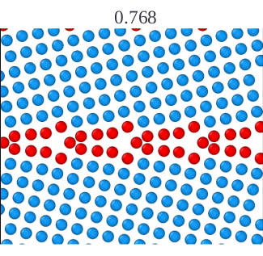
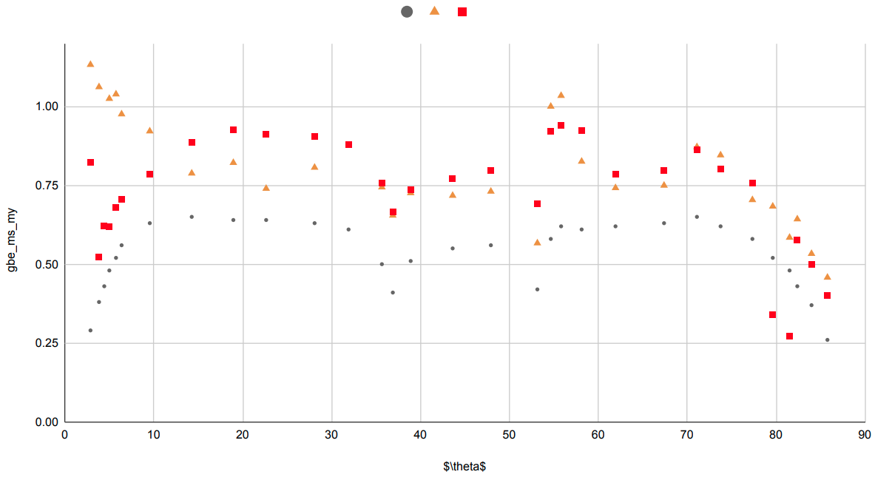
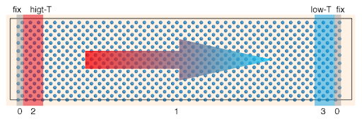
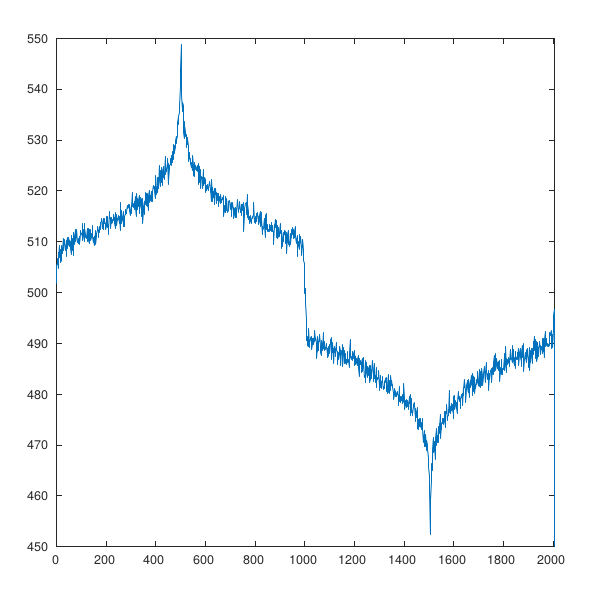

## Energy And Kapitza Conductance of Symmetric Tilt Grain Boundaries in Silicon

Last Updated: 02-Dec-2020

* [Abstract](https://scholars.iitm.ac.in/profile/ME17S300)
* [Research Profile](https://ilailabs.github.io/research-elankovanmg/)
* [Profile Page](https://ilailabs.github.io/profile-elankovanmg/docs/micron.html)

**Quick overview of my masters research project**

* Why to study GBs?
* What we studied?
* What do we observe?
* Summary of the work

###(1/8)Introduction to Polycrystalline Materials & Bi-Crystallography

* GBs influences the mechanical and thermal properties of a materials  

## (2/8) Bicrystal Geometries of GBs

* We were interested in Silicon. Since phononic contribution of thermal conductivity can be well studied in molecular dynamics simulations.

## (3/8) Most Frequent GBs Poly-Si

* We selected few STGBs in Si with <100> and <110> axis
* We modeled the GBs

| | Example of Low-angle GB ($8.5^o / <100>$) | Example of High-angle GB ($61.9^o / <100>$) |
|:--:|:-----:|:----:|
|   |   |  |

* The figure below shows the structure visualised in *ovito* software package with atoms near GBs in different color.

## (4/8) Energetics of <100> and <110> GBs

* We studied 31 GB samples using two different interatomic potentials
* These stable structures are used to find the GB thermal conductance(Kapitza conductance)

## (5/8) Idea of Non Equilibrium MD Simulation Technique

* We induce heat flux in the system by creating heat-source and heat-sink. Energy flows from high temperature regions to low temperature regions.

This figure illustrates the technique

* Since GB is 2d defect and offers resistance to the flow of heat energy across it. This results in temperature drop at the interface.

* The temperature gradient profile of $\Sigma 3 / <100>$ GBs is shown below. **We observe a temperature discontinuity at the interface**

## (6/8)Measure of Kapitza conductance

* Kapitza conductance is a direct measure of the temperature discontinuity observed at the interface.

$$J=\sigma_k \Delta T$$

## (7/8) Correlation between GB Energy and Interface Resistance

* GBs with higher energy has higher structural disorderness and offers higher resistance to the flow of thermal energy

## (8/8) Results on GB Structure & Kapitza conductance

* [Structures of <100> Si GBs](gbe_kap_results.pdf)
* [Thermal resistance of various Si GBs](gbe_str_results.pdf)
