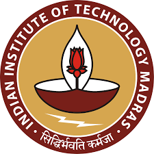

 [1. About Me](#myself) | [2. Research](#research) |  [3. Work Experience](#work)

[4. Academics](#acad)|    [5. Online Courses](#moocs) |    [6. Training & Certification](#training)

[7. Computer Proficiency & Skills](#computer) |  [8. Leisure Activities](#hobbies) |   [9. Interview FAQs](#faqs)

[10. Photo gallery](#gallery)

Remember to use the `HOME` button and `Ctrl+F` to navigate and search within this page.Click on the icon above to navigate.

**Please enter the last 3 digits of my IIT-M Placement registration number to open any PDF documents in this page**(Check the resume top right corner shared with you or [email](#email) me for the password)

Say, if my IITM Placement registration number is `55/ME/20/028` please enter `028` as a password.

 [**I Resume- Data Sciences and Machine Learning Profile**](docs/F2.pdf "Download as PDF")
 [**II Resume-Research Engineer Mechanical R&D**](docs/F1.pdf "Download as PDF")

## 1. About Me

I joined Computational Materials Modelling(CMM) Group in 2017 lead by [Prof. Narasimhan Swaminathan](https://home.iitm.ac.in/n.swaminathan/) as an interdisciplinary research scholar in the **Department of Mechanical Engineering(Design)** and in the **Department of Physics** under the research supervision of [Prof. C. V. Krishnamurthy.](http://iitm.irins.org/profile/61936)
My Inclination towards Science and Mathematics and the love that I had for my family was my motivation to join IITM to pursue research education.
My first real encounter with science was during my middle school days when I successfully electroplated a stainless-steel coin into a copper coated one with a mobile phone charger and unused copper wires (stole some copper sulphate salt from my chemistry lab)
I also couldn't believe in a few interesting things my physics teacher taught me, until I convinced myself doing small science experiments.
I was very curious and had too much fun experimenting with some science stuff and enjoyed playing with diodes, DC motors and LEDs with my cousin.
In Fact I think spending too much time with myself in my early childhood days has reflected in my introverted(mostly) personality when I grew up.
Those days were the happiest days of my life and I had aspirations of becoming a world class engineer someday since then.
I always had fascination over technology and the way they empower  humankind.
The Internet and flying machines were my favourite among them.

Philosophy and Psychology is something that I appreciate and understand apart from my discipline.
I was most influenced by the teachings of Dr. Jordan Peterson and his views on life and also inspired by the writings of american philosopher Dr. Wyane Dyer.
I recently developed some interest in Entrepreneurship and Behavioural science, influenced by the talks of [Simon Sinek](https://www.ted.com/talks/simon_sinek_how_great_leaders_inspire_action?utm_campaign=tedspread&utm_medium=referral&utm_source=tedcomshare) & some of the professors I met in the past few years, [Prof LSG](https://doms.iitm.ac.in/index.php/ganesh-l-s) (DoMs-IITM) and [Prof Murali](https://www.ubc.ca/about/one-on-one/leadership/murali-chandrashekaran.html) from UBC who mentored me for a [social project](https://drive.google.com/file/d/1JGrOQwY2iX0jIlT7IARku8VyugIvNgbP/view?usp=sharing).

## 2. Research at IITM

### <u>Kapitza Resistance And Elastic Phonon ScatteringProperties of Grain Boundaries in Diamond-Silicon</u>

I studied the thermal heat transport characteristics of various Grain Boundary(GB) interfaces in silicon bicrystal models using computer simulations.
GBs are very thin amorphous layers between two crystals with relative misorientation to each other as shown above.
When the thermal energy(heat) flows from crystal A(on the left) to crystal B(on the right) there is some energy loss due to thermal energy carrier scattering at the interface.
This results in a temperature drop or discontinuity to the flow of thermal heat current.
Different interfaces show different temperature drops to the same magnitude of thermal heat current, and therefore thermal boundary resistance is an intrinsic property of the interface.
I studied various symmetric tilt grain boundaries in Silicon trying to figure out on what factors these thermal boundary resistance depends.

  
To get deeper insights into the thermal boundary resistance, the later part of the research focuses on phonon-wave-packet(could be considered as a particle of heat) scattering at the interface.
Since the mechanism of Sound and Heat propagation in a crystalline solid is similar, we investigated the wave-packet that propagates across the interface. The animation below shows a wave-packet passing through an one-dimensional model of an interface where some part of a wave is reflected and most of them are transmitted at the interface.

**Potential Applications**:
* In the design of functional materials like microelectronic semiconductor devices
* Design of new structural materials for high thermal applications such as jet engine isolations, etc.

**Simulations Techniques**:
* Python and Matlab for modeling the GB-bicrystal samples.
* Molecular Dynamics(MD) techniques to perform heat flow simulations using [LAMMPS](https://lammps.sandia.gov/doc/Intro_overview.html) software package
* [OVITO](https://www.ovito.org/) software package to visualise the GB models
* OVITO-python interpreter, and python for post-processing the simulations results

<u>NOTE:</U> To read more visit my *Research Profile:* [ilailabs.github.io/research-elankovanmg](https://ilailabs.github.io/research-elankovanmg/)

## 3. Work Experiences

**Educator(Engineering Mathematics)**

*Type: Freelance*(Week-ends)

I have classroom teaching experience and online(via zoom) teaching experience in the following topics. My interest in maths and opportunity to develop my soft skill has motivated me to be a freelance educator.
* Determinants & Matrices
* Calculus & Differential Equations
* Vector Calculus
* Functions of Complex Variables
* Transforms
* Numerical Methods
* Applied Probability;
* Material Science

**Project Lead, (PrepLeaf Preparations Pvt. Ltd)**

*Type: Contract*

Earlier I started publishing the questions for my students to practise for their exams, later due to huge demand and market size([1,00,000+ users) I took this project seriously and collaborated the exam preparations company **PrepLeaf**
Myself and my friend has started building a faculty team who can develop good quality educational resources for the aspirants of TNEB-AE; With prepleaf as our technology partner I am leading the team of project onlinetangedco

Vist this [page](https://onlinetangedco.prepleaf.com/) if you are more interested to know about this project

* Roles Responsibilities: Planning the project; Assigning the tasks to teammates; Monitoring the progress.
* Also responsible for strategic marketing and sales of the product
* Scheduling of online mock exams, organizing and assigning the works to faculties to prepare study materials
* Team size: 3-core + 2-freelancers

**Project Associate, (Chennai Urban Resilience Program)**

*Type: summer intern (May 2019)*

This project is one of the best experiences I had in my IITM college life. The project is so exciting just because we were working on the real grounds interviewing people and collaborating with *chennai's resilience team* closely to give some practical solutions to Chennai's solid waste management.

* There were six teams from international universities(University of Cambridge, IIT Madras, Yale NUS College, University of British Columbia) and we worked on the project *Urban Horticulture*

[Project report](https://drive.google.com/file/d/1JGrOQwY2iX0jIlT7IARku8VyugIvNgbP/view?usp=sharing)

**PROJECTS**

[**UG Project: Investigation and Design of customized Airfoil for Low-Speed Vertical Axis Wind Turbine**](https://drive.google.com/file/d/1qnyJI7elBbaWzXqo5jAcWL0ETHLJdSd_/view?usp=sharing)
* We explored the possibility of a new design in the airfoil cross-section of VAWT. The new design is proposed based on
the lift to drag coefficient and the model is designed in CATIA V5 Sketcher

[**UG Mini Project: Kinetic Energy Recovery System Adopted Bicycles**](https://drive.google.com/file/d/1wX4jdMVWnylWz3MDtxqlHQnJEPqL1U0i/view?usp=sharing)
* A new brake mechanism that can store the kinetic energy of bicycles during the application of sudden breaks and a
a recovery system to release the stored energy is designed using an open coil spring and actuator. We tried to fabricate the
working prototype of this model.

[**Conceptual Design of Electromagnetic Damper for Motorcycle Suspension**](https://www.ijert.org/research/conceptual-design-of-electromagnetic-damper-for-motorcycle-suspension-system-IJERTV4IS080580.pdf)
* The new idea of using the multiple solenoidal-magnetic coils for the rear suspension of motorcycles is proposed. This
model uses an active feedback loop to control the damping forces through Electronic Control Unit making the suspension
active.

[**Flutter Application: Android and iOS Mobile Application**](https://github.com/ilailabs/quizz_app)
* My Quiz application helps the aspirants preparing for competitive exam by attempting quizzes
* Functionalities Implemented: (1)User Login & New user registration; (2) Display the contents of Notes & Quizzes
from google firestore; (3) Evaluates the quiz score with the marking schemes; (4) Makes the solution available for user
attempted the test; (5) User profile details
* Type: Hobby Project; Duration: 3 Weeks; Built Using: Android Studio with Dart Programming language;

**Numerical solution for plane problems using Finite Element approach [ME6800]** [report](https://drive.google.com/file/d/1qlO6gikFvM8olIuZs1krBnOrpLRwNnlU/view?usp=sharing)
* Simple truss and beam problems have been solved using Matlab;

**Uniaxial Tensile Test of Single Walled Carbon Nanotube: A MD approach[AM6512]** [report](https://drive.google.com/file/d/1HBfK0Vw_eVYvM5hteecS76lf7O8pvUOq/view?usp=sharing)
* Single walled carbon nanotube structure has been generated and uniaxial tensile testing has been performed using

**LAMMPS MD Simulation of Dislocation Dipole[ME7244]** [report](https://drive.google.com/file/d/16dBDbsLnraYNCkEd-oupO8mx89vTZTaV/view?usp=sharing)
* The dislocation dipole structure has been modeled using Matlab and the stable dislocation dipole structure and energy
has been calculated using LAMMPS

**Urban Horticulture Project [ID5120]** [report](https://drive.google.com/file/d/1JGrOQwY2iX0jIlT7IARku8VyugIvNgbP/view?usp=sharing)
* Household vegetable gardening is proposed to be the best solution to deal with degradable solid waste management

## 4. Academics

**EDUCATION**

| Institute | Programme | Year | |
|:---|:---|:---:|:--:|
| Indian Institue of Technology Madras, Chennai   | MS by Research   | 2020   | 7.8 |
| Thanthai Periyar Govt. Institute of Technology, Vellore | B.E in Mechanical | 2016 | 7.3 |
| Velammal Mat. Hr. Sec. School, Chennai | TN-Higher Secondary | 2012 | 92.9 |
| Velammal Mat. Hr. Sec. School, Chennai | TN-Matriculation | 2010 | 91.8 |

**ACCOMPLISHMENTS**

* Selected in International Winter School on Social Entrepreneurship organized by the Center for Social Innovation & Entrepreneurship at IIT Madras
* Winner: Paper presentation in National Technical Symposium-2014, CIPET, Chennai
* Best Paper presentation award CRANIKZ Symposium 2015, TPGIT, Vellore
* Winner: CAD Modelling in National Technical Symposium-2014, CIPET, Chennai
* Winner: CAD Modelling in National Technical Symposium-2015, Velammal Engg. College
* Winner: CAD Modelling in National Technical Symposium-2015, Adhiparasakthi College of Engg.
* Secured 93.4 percentile in GATE 2017 with score 522

**PUBLICATIONS**

<!-- | Year | Journal | Title |
|:---:|:---:|:---:|
| 2014 | Journal of Physics | Conceptual Design of ... |
| 2020  | Journal of ...  |  ... | -->

* Published a paper titled "Conceptual design of Electromagnetic Damper for motorcycle suspension" IJERT, Vol.4, Issue
08
* Working on a paper titled "Thermal Resistance and Energies of <100> Symmetric Tilt Grain Boundaries in Silicon"
* Expected to publish a paper titled "Thermal Resistance and Energies of <100> and <110> Symmetric Tilt Grain Boundaries in Silicon"

## 5. Online Courses

<!-- **Coursera**
* Int to matlab with fp
* 10 things
* Krish na garkipathy

**Nano-Hub**
* atoms-to-materials
* ht-at-nanoscales

**matlab academy**
* ML
* DL
* SM
* LA

**others** -->

* Apr 2020 - [Introduction to Flutter Development using Dart](https://www.appbrewery.co/p/intro-to-flutter) | AppBrewery [View project](https://github.com/ilailabs/quizz_app.git)
* Apr 2020 - [AWS Cloud Practitioner Essentials](https://drive.google.com/file/d/1tKv_DNOkCht43wJxD3zWGPMOf5qxZuh5/view?usp=sharing) | AWS training
* Dec 2019 - [Introduction to Statistics With Matlab](https://matlabacademy.mathworks.com/progress/share/certificate.html?id=0a971607-752c-4a8d-9fe7-92bb788f03d6) | Matlab Academy
* Nov 2019 - [Introduction to Linear Algebra With Matlab](https://matlabacademy.mathworks.com/progress/share/certificate.html?id=534e9419-8eb6-49f5-840e-a7f0dbcf25ee) | Matlab Academy
* Sep 2019 - [Machine Learning With Matlab](https://matlabacademy.mathworks.com/progress/share/certificate.html?id=1674b012-f16d-4352-ad96-1d9c2bd8be09) | Matlab Academy
* Jun 2019 - [Deep Learning With Matlab](https://matlabacademy.mathworks.com/progress/share/certificate.html?id=2e4dc323-6a87-4bdc-8736-56b2811f875b) | Matlab Academy
* Apr 2019 - [Joy of Computing Using Python](https://nptel.ac.in/noc/Ecertificate/?q=noc19-cs09/NPTEL19CS09S61221598191073298.jpg) | NPTEL-IIT Ropar

To know the list of all courses check this [page](docs/MY_COURSES/allcourses.html)

[comments]:(#training)

## 6. Training & Certification

[**Master Diploma In Automotive Design**](https://drive.google.com/file/d/1kspvXkDuXKa-Qrk0t3N7LrebC_PwDFDq/view?usp=sharing)

I completed this 300+ Hours course over a period of 2 years during my undergraduates; I spend my weekends learning and practising CAD modelling those days.

* CATIA V5(complete software package)
* Creo 2.0
* Nx-CAD
* Nx-CAM
* Nx-Nastran
* Ansys
* Basics of GD&T
* Autocad 2D

## 7. Computer Proficiency & Skills

* Programming Languages: [Python(intermediate)](https://ilailabs.github.io/python/), Dart
* Scientific Computing: [MATLAB(proficient)](https://ilailabs.github.io/python/matlab/index.md.html), SageMath, Mathematica
* CAD Modelling: CATIA V5(proficient), SolidWorks, NX-CAD
* Simulation Tools: LAMMPS, NX-Nastran, Ansys
* Documentation:: Markdown(proficient), LaTex(intermediate)
* Linux OS: [Shell scripting in linux](https://ilailabs.github.io/python/bash/index.md.html)

**Others**
* I have been using linux for more than 3+ years(much comfortable with ubuntu)
* Good at writing scripts in matlab. I mostly use matlab for my academic research.
* Intermediate skills in python. I can write my own python scripts to accomplish any given task with other references.
* I use markdown to document all academic and personal stuff.
* I am familiar with cloning a project from github and developing on it. I am exposed to repos, pull and push request from local machine

Please check out the above links if you are interested to know about my style of writing scripts. I started using *Leetcode* and *project euler* to practise problems during my leisure hours for placements.

[My Leetcode profile](https://leetcode.com/elankovanmg/)

[My LeetCode documentation](/home/elankovan/Dropbox/python/leet/INDEX.md.html)

## 8. Leisure Activities & Hobbies

* Playing guitar
* Indian classical music

**Hobbies for fitness**
* squash
* swimming
* cycling

## 9. Interview FAQs & Job Expectations

* Tell us about yourself?
* Why do you think you're the best fit to our organisation?
* Are you interested in job roles relevant to data science/analytics/ML being a mechanical engineer?
* What's your motivation to learn programming?
* Tell us about your research experience at IIT Madras?
* What would be your criteria to choose a job-offer in case you get multiple offers?
* Are you willing to relocate?
* What's your primary job expectations?
* How do you see yourself in the next five years?
* How good are you working with teams?
* What is that one thing that drastically improved your productivity recently?
* How do you deal with distraction at work/productive hours?
* What helps you stay motivated when you face challenges or when things didn't work?
* Tell us about your first job interview experiences?
* What's your opinion about entrepreneurship?
* Why do you think leadership skills are extremely important?
* What are your strengths? What are the things that you're proud of yourself?
* What are your weaknesses? Have you taken any steps to improve them?
* What are the few qualities that you admire in yourself?
* What qualities do you admire in a leader?
* What's your motivation to teach Engineering Mathematics?
* I have something else to ask you?

## 10. Photo Gallery

**Motivation talk to freshmen**

**Selected in Urban resilience international workshop**

**Selected in winter school on social entrepreneurship by CSIE, IITM**

[View all](images/gallery.md.html)

## Personal Details

* Date Of Birth: 05/11/1994
* Age: 25 y.o, Male
* Permanent Residence: Chennai, Tamil Nadu
* Father Occupation: Merchant and self-employed
* Mother: Homemaker and Tailor
* Siblings: One elder Sister(married) and works in IT

----------------------------
**Disclaimer**:
Contents in this page are genuine and accurate to the best of my knowledge. And intended only for recruitment purposes. Please do not disclose or share any personal information without my consent.

 Written by: Elankovan M. G.(candidate) in [markdown](https://github.com/ilailabs/profile-elankovanmg/blob/master/index.md) with atom text editor
 Last Updated: 10-October-2020

  **elankovanmg@gmail.com**
  +91 99402 75\*\*\*
 [#elangovan_ilai](https://twitter.com/elangovan_ilai)
 [linkedin.com/in/elankovanmg](https://www.linkedin.com/in/elankovanmg/)
 [scholars.iitm.ac.in/profile/ME17S300](https://scholars.iitm.ac.in/profile/ME17S300)

  Page Views: 
  Unique Viewers:  Since June 2020
